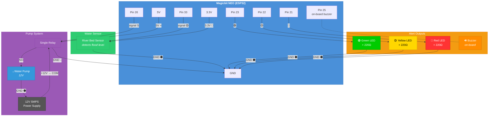

# Smart Country - Flood Alert System

**Gateway College Colombo - IT Exhibition 2026**
**Student:** Mikeyla, Grade 4

A smart flood warning system built with the Magicbit NEO (ESP32) board. The pump automatically fills a reservoir that overflows into a river bed model. Water level sensors detect flooding and trigger visual and audio alerts.

## How It Works

1. Power on → pump fills reservoir → water overflows to river bed
2. River bed sensor detects rising water
3. **GREEN** (safe) → **YELLOW** (warning) → **RED + siren** (flood!)
4. Flood detected → pump stops automatically
5. Water drains naturally → alerts stop
6. After 5 seconds at safe level → pump restarts
7. Cycle repeats

## Wiring Diagram

## Pin Map

| Component | Pin | Wire Color |
|---|---|---|
| River bed sensor (signal) | 33 | Yellow |
| River bed sensor (VCC) | 3.3V | Red |
| River bed sensor (GND) | GND | Black |
| Relay S | 26 | Purple |
| Relay + | 5V | Red |
| Relay – | GND | Black |
| SMPS +12V | Relay COM | Red |
| Relay NO | Pump + (red) | Orange |
| Pump – (black) | SMPS GND | Black |
| Green LED + 220Ω | 23 | Green |
| Yellow LED + 220Ω | 22 | Yellow |
| Red LED + 220Ω | 21 | Red |
| Buzzer | 25 | On-board |

## Alert Levels

| Level | LED | Buzzer | Condition |
|---|---|---|---|
| **SAFE** | 🟢 Green | Off | River bed < 50 |
| **WARNING** | 🟡 Yellow | Soft beep | River bed > 100 |
| **FLOOD** | 🔴 Red (flashing) | Loud siren | River bed > 1500 |

## Hardware

- **Board:** Magicbit NEO (ESP32-WROOM-32UE)
- **Water Sensor:** Analog water level sensor
- **Pump:** 12V water pump
- **Relay:** Single channel relay module
- **Power:** 12V SMPS for pump, USB for NEO
- **LEDs:** 3x (green, yellow, red) with 220Ω resistors
- **Buzzer:** On-board (Pin 25)

## Code

Main sketch: [`flood_alert_v2/flood_alert_v2.ino`](flood_alert_v2/flood_alert_v2.ino)

Built with Arduino IDE — select **ESP32 Dev Module**, upload speed **115200**.
