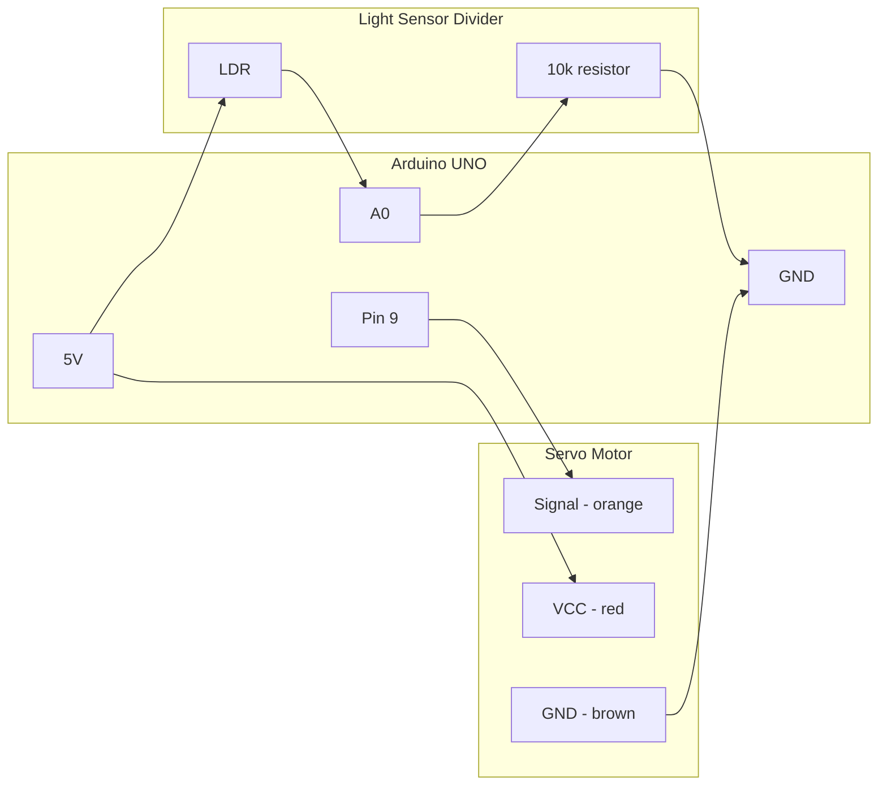

# Smart Green House - Robot B: Shading Control

**Gateway College Colombo - IT Exhibition**
**Student:** Mikeyla

A greenhouse shade that opens and closes by itself. A light sensor (LDR) watches
the sunshine. When it gets too bright, a servo motor pulls a shade over the
plants. When the light drops again, the shade opens back up.

Two sketches live here:

| Sketch | What it is for |
|---|---|
| `../ldr_calibrate/ldr_calibrate.ino` | **Run this first.** Finds the two light numbers for your sensor |
| `shade_control.ino` (this folder) | The real exhibition sketch |

## How It Works

1. LDR is read every second (15 readings, middle one taken)
2. The reading is turned into a light level, 0% (dark) to 100% (bright)
3. Above **70%** → servo moves to 90° → **shade CLOSED**
4. Below **55%** → servo moves back to 0° → **shade OPEN**
5. The shade moves 1° at a time so it glides instead of snapping
6. Runs forever, no buttons needed

## Wiring Diagram



### ASCII version (for the bench)

```
   5V ────────[ LDR ]────┬──── A0
                         │
                    [ 10k Ω ]
                         │
   GND ──────────────────┘


   Pin 9 ──────── orange   ┐
   5V    ──────── red      ├─ Servo
   GND   ──────── brown    ┘
```

**The 10k resistor is not optional.** Without it, pin A0 is floating and the
reading barely changes between light and dark. That is the single most common
reason this project "does nothing".

Wiring the LDR to GND and the resistor to 5V instead is also fine. It only flips
whether bright light makes the number bigger or smaller, and the sketch handles
both.

## Pin Map

| Pin | Connected to | Notes |
|---|---|---|
| A0 | LDR / 10k divider junction | Analog in |
| 9 | Servo signal | PWM |
| 5V | LDR top of divider, servo power | See servo power note below |
| GND | Bottom of divider, servo ground | Common ground |

## Calibration - Do This First

The numbers in the sketch (`DARK_VALUE 900`, `BRIGHT_VALUE 200`) are a **guess**.
Every LDR and every resistor is slightly different. If they are wrong, the shade
either never moves or never stops moving — and the light level looks almost the
same in the dark as it does in bright light.

1. Upload `ldr_calibrate/ldr_calibrate.ino`
2. Open Serial Monitor at **9600**
3. Shine a torch on the LDR for about 5 seconds — watch MIN and MAX
4. Cover the LDR with your hand for about 5 seconds — watch MIN and MAX
5. Write down the two numbers
6. Put them into `shade_control.ino`:
   - `BRIGHT_VALUE` = the reading under the torch
   - `DARK_VALUE` = the reading under your hand
7. Upload `shade_control.ino`

The calibration sketch prints a **SPREAD** figure. If SPREAD stays under 150, the
sensor is not really working — check the 10k resistor, check the LDR legs are in
the right rows, and try a brighter torch.

Send any letter in Serial Monitor to reset MIN/MAX and measure again.

## Threshold Table

| Setting | Value | What it does |
|---|---|---|
| `DARK_VALUE` | 900 | Raw reading with the sensor covered — **measure this** |
| `BRIGHT_VALUE` | 200 | Raw reading under a torch — **measure this** |
| `BRIGHT_CLOSE` | 70 | Above this % the shade closes |
| `BRIGHT_OPEN` | 55 | Below this % the shade opens |
| `SHADE_OPEN` | 0° | Servo position, shade open |
| `SHADE_CLOSED` | 90° | Servo position, shade closed |
| `SERVO_SPEED` | 20 ms | Time per 1° step. Smaller = faster |
| `SAMPLES` | 15 | Readings per measurement (median) |
| `LOOP_DELAY` | 1000 ms | Time between light checks |

### Why two thresholds and not one?

With a single threshold at 70%, light sitting right on the line makes the servo
flap open and shut every second. The 15% gap between `BRIGHT_CLOSE` and
`BRIGHT_OPEN` means the shade has to genuinely get darker before it reopens. It
is the same trick the greenhouse pump uses with `SOIL_DRY` / `SOIL_WET`.

### Why a median and not an average?

A single `analogRead()` jumps around, especially while the servo is moving. The
sketch takes 15 readings, sorts them, and uses the middle one. One wild spike is
ignored completely, where an average would be dragged along by it.

## Status Table

| Light level | Serial says | Servo | Shade |
|---|---|---|---|
| Above 70% | `too bright, CLOSING shade` | 90° | Closed |
| 55% - 70% | `no change` | unchanged | Stays as it was |
| Below 55% | `light is fine, OPENING shade` | 0° | Open |

## Servo Power Note

If the servo runs off the UNO's own 5V pin, it drags the voltage down every time
it moves — and because the LDR is measured against that same 5V, the readings
jump while the shade is moving.

For a small 9g servo (SG90) on a short demo this is usually fine. If the Serial
readings look unstable, give the servo its own 5-6V supply and join the two GNDs
together.

## Serial Output

Both sketches print at **9600 baud**.

`ldr_calibrate`:

```
Now: 412   MIN: 188   MAX: 903   SPREAD: 715   <-- good, usable range
```

`shade_control`:

```
LDR Raw: 412 | Light: 70% | Shade: 0 deg (OPEN) -> no change
LDR Raw: 240 | Light: 94% | Shade: 0 deg (OPEN) -> too bright, CLOSING shade
LDR Raw: 851 | Light: 7%  | Shade: 90 deg (CLOSED) -> light is fine, OPENING shade
```

## Board Note

These two sketches are written for the **Arduino UNO** — `Servo.h`, 5V logic, and
a 0-1023 analog range.

They will **not** work unchanged on the Magicbit NEO. The NEO needs `ESP32Servo`
instead of `Servo.h`, and its analog range is 0-4095, which makes every number in
the threshold table wrong. If this moves to the NEO, recalibrate from scratch.
