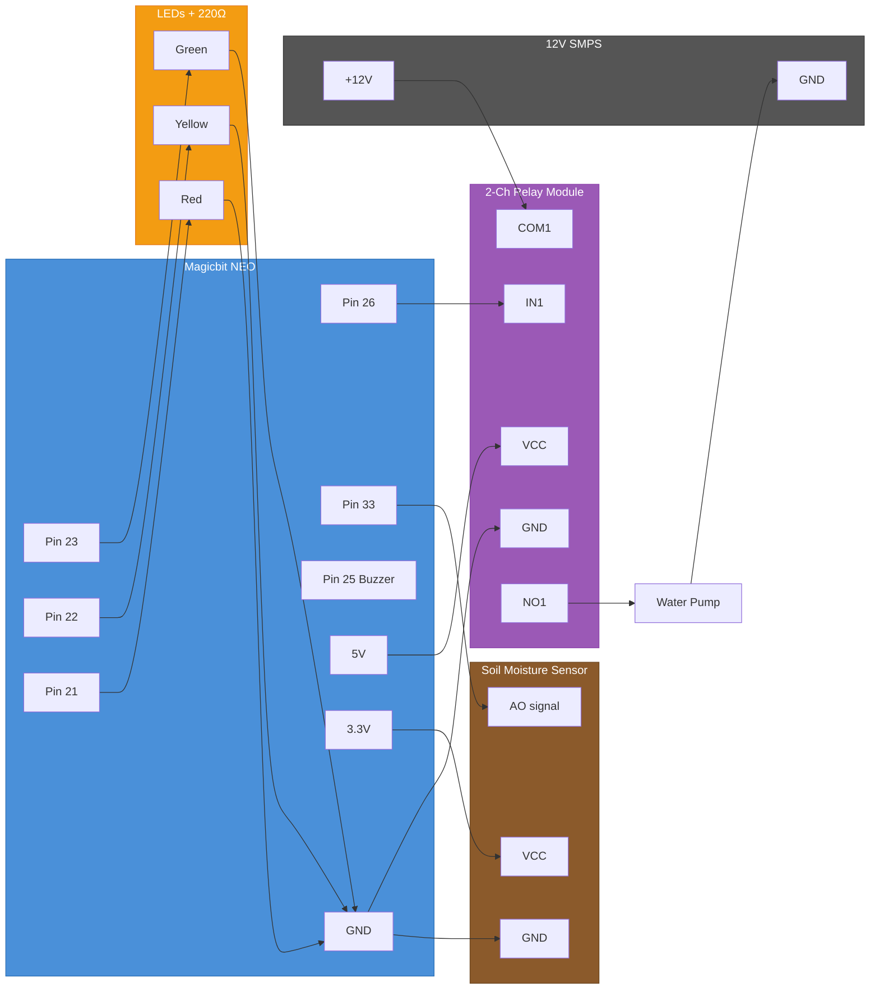

# Smart Country - Smart Green House

**Gateway College Colombo - IT Exhibition**
**Student:** Mikeyla, Grade 5

A greenhouse that looks after a plant by itself. A soil moisture probe checks how
thirsty the plant is, and a pump waters it automatically when the soil gets too dry.

## How It Works

1. Soil probe reads the soil every third of a second
2. **GREEN** = happy plant → **YELLOW** = getting dry → **RED** = too dry
3. Too dry → **pump turns on** and waters the plant
4. Soil wet again (or 5 second safety limit) → pump stops, happy beep
5. Waits 10 seconds for the water to soak in before checking again
6. Runs forever, no buttons needed

## Wiring Diagram



### ASCII Wiring Reference

```
=== MAGICBIT NEO CONNECTIONS ===

NEO Pin 26  ──────→  Relay IN1 (signal)
NEO 5V      ──────→  Relay VCC
NEO GND     ──────→  Relay GND

NEO Pin 33  ←──────  Soil Sensor AO (signal)
NEO 3.3V    ──────→  Soil Sensor VCC (+)
NEO GND     ──────→  Soil Sensor GND (–)

NEO Pin 23  ──────→  Green LED (+) ──→ 220Ω ──→ GND
NEO Pin 22  ──────→  Yellow LED (+) ─→ 220Ω ──→ GND
NEO Pin 21  ──────→  Red LED (+) ───→ 220Ω ──→ GND

NEO Pin 25  ──────→  Buzzer     (on-board, no wiring)


=== RELAY TO PUMP (12V CIRCUIT) ===

SMPS +12V   ──────→  Relay COM1
Relay NO1   ──────→  Pump + (red)
Pump – (black) ───→  SMPS GND

Note: 2-channel relay module, active-low (LOW = ON)
      Same relay and pump as the flood alert project.

!! TERMINAL ORDER ON OUR MODULE (measured, not the usual layout) !!

      left group of screw terminals = K1
      ┌───────┬───────┬───────┐
      │  NC1  │ COM1  │  NO1  │
      └───────┴───────┴───────┘
          1       2       3
                  │       │
             SMPS +12V  Pump + (red)

      Most guides say NO, COM, NC. Ours is NC, COM, NO.
      The pump goes in the THIRD terminal, not the first.
      Verified: 12V appears on terminal 3 only while the red LED is on.
```

## Pin Map

| Component | Pin | Wire Color |
|---|---|---|
| Soil sensor AO (signal) | 33 | Yellow |
| Soil sensor VCC | 3.3V | Red |
| Soil sensor GND | GND | Black |
| Relay IN1 | 26 | Purple |
| Relay VCC | 5V | Red |
| Relay GND | GND | Black |
| SMPS +12V | Relay COM1 (**middle** of left group) | Red |
| Relay NO1 (**3rd** terminal of left group) | Pump + (red) | Orange |
| Pump – (black) | SMPS GND | Black |
| Green LED + 220Ω | 23 | Green |
| Yellow LED + 220Ω | 22 | Yellow |
| Red LED + 220Ω | 21 | Red |
| Buzzer | 25 | On-board |

## Plant Status

| Status | LED | Buzzer | Pump | Condition |
|---|---|---|---|---|
| **HAPPY** | Green | Off | Off | Dryness < 1950 |
| **GETTING DRY** | Yellow | Off | Off | Dryness > 1950 |
| **TOO DRY** | Red | Beep | **ON** | Dryness > 2250 |
| **WATERED** | Green | Happy beep | Off | Dryness < 1600 |
| **CHECK ME** | Red, fast blink | Low beep every 3s | **Off** | Watered 3 times, soil still dry |

## Measured Values (this board, this sensor)

| Probe in | Reading |
|---|---|
| Air | 2559 |
| Bone dry soil | 2520 |
| Well watered soil | 1416 |

Dry soil and air read almost the same (2520 vs 2559), so the sketch **cannot** tell a
fallen-out probe from very dry soil. That is what the "CHECK ME" state is for — see
Safety Settings below.

## Re-calibrate After Any Rebuild

Different soil, a different probe, or a re-potted plant changes these numbers:

1. Upload **`soil_test/soil_test.ino`**, open Serial Monitor at 115200.
   - Probe in dry soil → write the number down
   - Probe in well-watered soil → write the number down
   - Set `SOIL_WET` just above the wet number, `SOIL_DRY` just below the dry number,
     and `SOIL_WARN` halfway between.
   - If the number goes **down** when dry, set `SOIL_DRY_IS_HIGH` to `false`.
2. Upload `smart_green_house.ino` and watch the Serial Monitor while you water the plant.

## Safety Settings

| Setting | Value | Why |
|---|---|---|
| `MAX_WATER_MS` | 5000 | Pump can never run more than 5 seconds — no flooding the table |
| `SOAK_TIME` | 10000 | Waits 10 seconds after watering so water can spread before re-checking |
| `MAX_TRIES` | 3 | After 3 waterings that left the soil dry, the pump shuts off and the red LED blinks fast with a low beep. Catches an empty tank, a probe that fell out of the pot, or a pump that stopped working — instead of pumping water across the exhibition table all afternoon. Push the probe back in (or refill the tank) and it recovers by itself. |

Keep the pump's water tank topped up — a 12V pump run dry can damage itself.

## Hardware

- **Board:** Magicbit NEO (ESP32-WROOM-32UE)
- **Soil sensor:** Analog soil moisture probe
- **Pump:** 12V water pump (same one as the flood project)
- **Relay:** 2-channel relay module (active-low, using CH1)
- **Power:** 12V SMPS for pump, USB for the NEO
- **LEDs:** 3x (green, yellow, red) with 220Ω resistors
- **Buzzer:** on-board, no wiring

## Code

Main sketch: [`smart_green_house.ino`](smart_green_house.ino)
Calibration: [`../soil_test/soil_test.ino`](../soil_test/soil_test.ino)

Built with Arduino IDE — select **ESP32 Dev Module**, upload speed **115200**.
